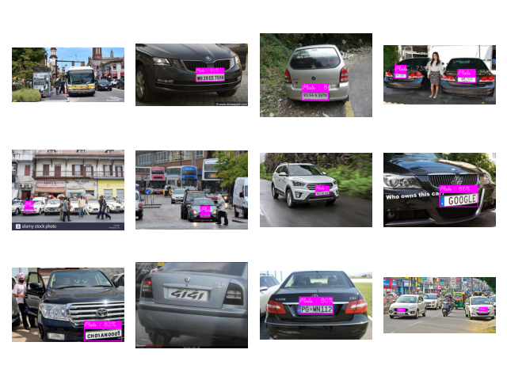

# Number Plate Detection (YOLO)

1. [Preprocess data](Number_plate_recognition.ipynb)
2. [Train yolo](Training_of_yolo.ipynb) 
3. [Make Predictions](yolo_predictions.py)
4. [Save Model](Saved_Model)
5. [Testing on Test Data](testing)

# Results
## Metrics

## Training images

## Validation images

## Test Images

